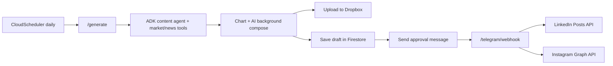

# stock-market-social-agent

A daily US stock market recap agent: gathers market data + news with a
[Google ADK](https://github.com/google/adk-python) / Gemini agent, generates
LinkedIn and Instagram post copy plus a branded chart image, sends it to
Telegram for a pre-posting approval, and - once approved - publishes to
LinkedIn (personal profile + Company Page) and Instagram, archiving every
generated image to Dropbox. Runs serverless on Google Cloud Run with Cloud
Scheduler.

## How it works



See the full design write-up (data flow, API prerequisites, operational
concerns) in the plan this was built from, and the prerequisite external
setup in [`docs/ACCESS_SETUP_CHECKLIST.md`](docs/ACCESS_SETUP_CHECKLIST.md).

## Project layout

```
agent/            ADK content-writer agent + market data / news tools
imaging/          Chart rendering, AI background generation, image compose
services/         Config, secrets, Dropbox, Firestore, Telegram, Instagram,
                   LinkedIn, token refresh
pipeline.py       Orchestrates generate -> approve -> publish
main.py           FastAPI app (Cloud Run entrypoint)
deploy/           Cloud Run + Cloud Scheduler + Telegram webhook setup
docs/             Access/credentials checklist
```

## Local development

```bash
python -m venv .venv
.venv\Scripts\activate          # on Windows PowerShell: .venv\Scripts\Activate.ps1
pip install -r requirements.txt
copy .env.example .env          # then fill in the values you already have
```

Run the content agent alone (no Telegram/Dropbox/social credentials needed):

```bash
python -c "from agent.agent import generate_post_draft; print(generate_post_draft())"
```

Run the full FastAPI app locally:

```bash
uvicorn main:app --reload --port 8080
```

Trigger a draft manually:

```bash
curl -X POST http://localhost:8080/generate -H "X-Scheduler-Secret: $SCHEDULER_SECRET"
```

You should see a Telegram message with the image and both captions, with
Approve/Reject buttons - tapping them only works once the service is
reachable from the internet (e.g. deployed, or tunneled with `ngrok`/`cloudflared`
during local testing) and the webhook is registered per
`deploy/telegram_webhook_setup.md`.

## Deploying

1. Work through [`docs/ACCESS_SETUP_CHECKLIST.md`](docs/ACCESS_SETUP_CHECKLIST.md) and load every secret into Secret Manager.
2. `bash deploy/deploy.sh`
3. `bash deploy/scheduler_setup.sh`
4. Follow `deploy/telegram_webhook_setup.md` to register the Telegram webhook.

## Notes and current limitations

- Instagram Graph API and LinkedIn's Company Page posting both require
  platform approval that can take days to weeks - see the checklist doc.
  The code works against sandbox/test credentials in the meantime.
- "Top movers" are computed from a configurable watchlist (`MARKET_WATCHLIST`
  env var), not the full market, since a true full-market screener needs a
  paid data feed.
- Imagen was deprecated in August 2026; image generation uses
  `gemini-2.5-flash-image` ("Nano Banana") instead.
